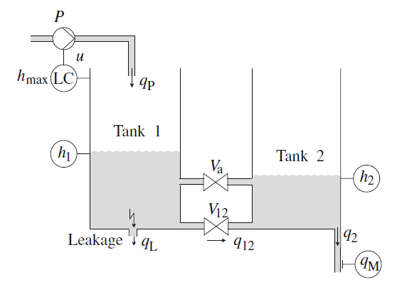

# Two tank model

Variables:

- $h_1, h2$ - tank kevels in meters
- $q_m$ - Measured outflow in litres per minutes
- $u$  - Control input to the pump
- $q_{12}, q_2, q_P, q_L$ - Volume flows in cubic metres per second

Parameters:

- $A = 1.54 · 10^{−2}m^2$ - Cross-section area of both tanks
- $h_{max} = 0.60 m$ - Height of both tanks
- $u_{nom} = 1.0$ - Nominal pump velocity
- $u_{max} = 5.0$ - Maximal pump velocity
- $c_{12} = 6.0 · 10^{−4}m^{5/2}/s$ - Flow constant of valve $V_{12}$
- $c_2 = 2.0 · 10^{−4}m^{5/2}/s$ - Flow constant of the outlet of Tank 2
- $c_L = 8.0 · 10^{−4}m^{5/2}/s$ - Flow constant of a leakage in Tank 1
- $c_M = 12.01/(min · m^{1/2})$ - Constant of outflow sensor
- $\bar{q}_P = 1.5 · 10^{−4}m^{3}/s$ - Flow constant of the pump

Dynamic equations:

$$
\dot{h}_1(t) = \frac{1}{A}(q_P(t)-q_L(t)-q_{12}(t))\\
\dot{h}_2(t) = \frac{1}{A}(q_{12}(t) - q_2(t))
$$

Measured signal:

$$
q_m = c_Mq_2
$$

Flows equations:

$$
q_{12}(t)=\left \{
    \begin{array}{ll}
        c_{12}\textrm{sign} (h_1(t) - h_2(t))\sqrt{|h_1(t)-h_2(t)|} & \textrm{if } V_{12} \textrm{ is open}\\
        0 & \textrm{else}
    \end{array}
\right.\\
q_{2}(t)=\left \{
    \begin{array}{ll}
        c_{2}\sqrt{h_2(t)} & \textrm{if } h_{2}(t)>0\\
        0 & \textrm{else}
    \end{array}
\right.\\
q_{P}(t)=\left \{
    \begin{array}{ll}
        u(t)\bar{q}_P & \textrm{if } h_{1}(t)\le h_{max}\\
        0 & \textrm{else}
    \end{array}
\right.\\
q_{L}(t)=\left \{
    \begin{array}{ll}
        c_L\sqrt{h_1(t)} & \textrm{if } h_{1}(t)>0 \textrm{ and Tank 1 has a leakage}\\
        0 & \textrm{else}
    \end{array}
\right.\\
$$
